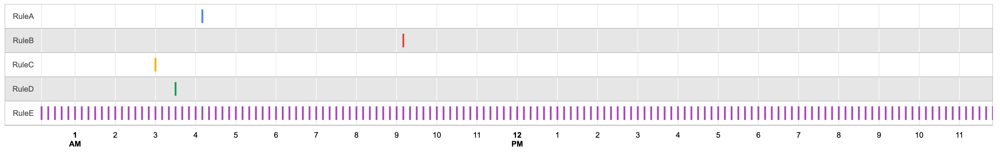

# aws-cronv
Visualize your EventBridge's cron schedules :clock3:



## Usage
```sh
aws events list-rules | npx aws-cronv >| events.html

# you can also specify from-datetime
aws events list-rules | npx aws-cronv 2022-01-01T00:00:00+09:00 > events.html
```

## TODO
- command line options (e.g. duration)

## Patches
Welcome!
